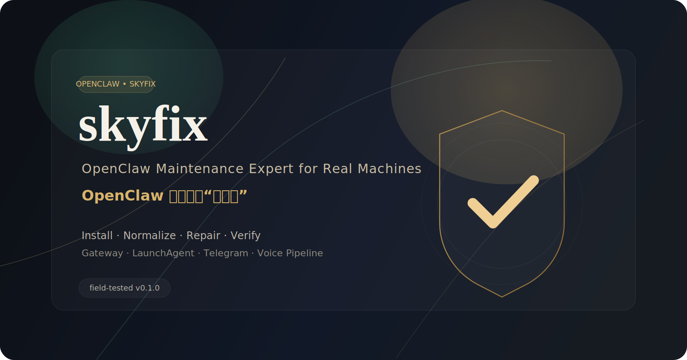

# skyfix
## OpenClaw Maintenance Expert for Real Machines

**English** | [中文](./README.zh-CN.md)



**The OpenClaw repair mechanic you actually want on call.**

`skyfix` is a self-contained OpenClaw maintenance expert for real-machine operations.
It handles installation, upgrade, repair, permission normalization, gateway / LaunchAgent recovery, desktop shortcuts, Telegram diagnostics, and voice pipeline troubleshooting — with verification, not superstition.

> 中文解读：`skyfix` 是 OpenClaw 最靠谱的“修机佬”。

---

## Why it exists

OpenClaw failures rarely happen as a single neat bug.
They usually sprawl across:

- broken installs
- mixed config state
- model / permission drift
- gateway or LaunchAgent failures
- Telegram delivery problems
- missing voice pipeline dependencies
- remote-machine entropy

`skyfix` exists to treat those as **one maintenance system**, not a random pile of shell commands.

---

## Core capabilities

- **Install and bootstrap OpenClaw** on fresh machines
- **Upgrade, reinstall, and repair** broken OpenClaw states
- **Normalize model, permission, and config posture**
- **Recover gateway / LaunchAgent health**
- **Create desktop shortcuts and quick-access surfaces**
- **Diagnose Telegram / ASR / TTS / voice delivery issues by fault layer**
- **Produce verification-oriented maintenance outcomes**, not just “I tried something”

---

## What makes it different

### 1. Fault-layer thinking
`skyfix` tries to determine whether the problem is:

- config
- credential
- network
- service/runtime
- media strategy
- missing dependency
- platform-side limitation

That sounds obvious. In practice, most repair flows skip this and go straight to blind reinstall roulette.

### 2. One orchestrator, one system
`skyfix` is designed as the **single maintenance orchestrator**.
It can absorb useful patterns from other skills, but it does not let external control protocols hijack runtime behavior.

### 3. Field-tested behavior
`skyfix` has already been exercised on a real machine maintenance run, including:

- runtime inspection
- config normalization
- gateway / LaunchAgent repair
- desktop shortcut generation
- Telegram / voice diagnostics

---

## V0.1 scope

### Included
- install / bootstrap
- upgrade / reinstall / repair
- config + permission normalization
- gateway / LaunchAgent repair
- desktop shortcuts
- Telegram diagnostics
- ASR / TTS / Telegram voice diagnostics
- Telegram file / media / voice delivery strategy diagnosis
- post-run retrospective guidance

### Intentionally limited
- WeChat is **lite diagnosis only** in V0.1
- self-evolution is **suggestion-only**, not autonomous self-modification
- issue intelligence is used on difficult or ambiguous failures, not every tiny bug

---

## Repository layout

```text
openclaw-skyfix/
├── README.md
├── LICENSE
├── CHANGELOG.md
├── dist/
│   └── skyfix.skill
└── skill/
    └── skyfix/
        ├── SKILL.md
        ├── references/
        └── scripts/
```

---

## Install

### Option A — Download the packaged skill
1. Go to **Releases**
2. Download `skyfix.skill`
3. Install it using your normal OpenClaw skill import / install flow

### Option B — Use the unpacked skill folder
Use the `skill/skyfix/` directory directly in a development or local-skill workflow.

---

## Example prompts

- `Install OpenClaw on this machine and set it up properly.`
- `Repair my OpenClaw install and normalize the config.`
- `Fix gateway / LaunchAgent on this Mac.`
- `Check why Telegram delivery is failing.`
- `Diagnose the voice reply pipeline.`
- `Go to em2t and normalize OpenClaw there.`

---

## Public release posture

This repository is the **public product surface** for `skyfix`.
It is intentionally narrower and cleaner than the private development workspace.

That means:
- only public-safe skill contents live here
- no personal memory files
- no unrelated workspace projects
- no machine secrets, tokens, or private node credentials

---

## Versioning

Current public starting point:

- **v0.1.0** — first public release candidate

Why not `v1.0.0` yet?
Because it is already useful and field-tested, but not yet the final shape of the full maintenance product.

That’s not weakness. That’s discipline.

---

## License

This repository currently uses the MIT License.
If a different license posture is needed later, it can be changed before broader downstream adoption.

---

## Release notes

See:
- [`CHANGELOG.md`](./CHANGELOG.md)
- [`releases/v0.1.0.md`](./releases/v0.1.0.md)

---

## Maintainer note

This project is being shaped as a real operator tool, not a demo artifact.
If you use it, treat it like a maintenance expert: give it a real machine problem, then verify the result like you mean it.
